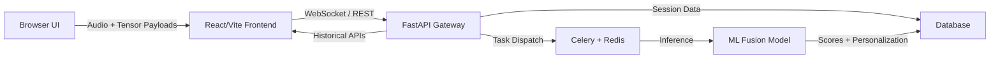

# VerboTech


> VerboTech is an AI-powered public speaking and confidence analytics platform built for modern teams and learners.

## Project Overview

VerboTech combines browser-based speech capture, multimodal machine learning, and production-ready APIs to convert a speaking session into actionable confidence metrics, behavior insights, and session history.

Core capabilities:

- Real-time speech confidence analysis
- Vocal pacing, projection, and silence detection
- Facial engagement and posture analysis
- Multimodal fusion scoring with audio + vision embeddings
- Session history, feedback capture, and personalization

## What’s Included

- `confidence-speaker/` — React + Vite frontend for recording, telemetry, and dashboard UX.
- `confidence-backend/` — FastAPI gateway, session API, WebSocket ingestion, and Celery worker orchestration.
- `ml/` — AI/ML architecture blueprints and model descriptions for HuBERT, TCN vision, and fusion inference.

## Architecture Summary



## Quick Start

### Backend

```powershell
cd confidence-backend
..\.venv\Scripts\Activate.ps1
..\.venv\Scripts\python.exe -m uvicorn main:app --reload --host 0.0.0.0 --port 8000
```

### Frontend

```powershell
cd confidence-speaker
npm install
npm run dev -- --host 0.0.0.0
```

Then open `http://localhost:5173/`.

## Documentation

- [Architecture](docs/architecture.md)
- [API](docs/api.md)
- [ML Pipeline](docs/ml-pipeline.md)
- [Deployment](docs/deployment.md)
- [Setup](docs/setup.md)
- [Environment Variables](docs/environment.md)
- [Security](docs/security.md)
- [Contributing](docs/contributing.md)
- [Roadmap](docs/roadmap.md)

## Production Readiness

VerboTech is structured to support a production deployment path with:

- API gateway isolation
- asynchronous worker scaling
- persistent storage for session telemetry
- frontend-hosted static delivery
- documented environment and security controls

## Recommended Next Steps

1. Review `docs/deployment.md` for production configuration.
2. Validate environment variables in `docs/environment.md`.
3. Add CI/CD and monitoring around the `confidence-backend` and `confidence-speaker` services.

---

## Codebase Highlights

```text
confidence-backend/
  main.py
  workers/
    celery_app.py
    tasks.py
  ml/models/
    fusion.py
    hubert_audio.py
    tcn_vision.py
confidence-speaker/
  src/
  package.json
  vite.config.js
ml/
  README.md
```

For a full deep dive, start with `docs/architecture.md`.
