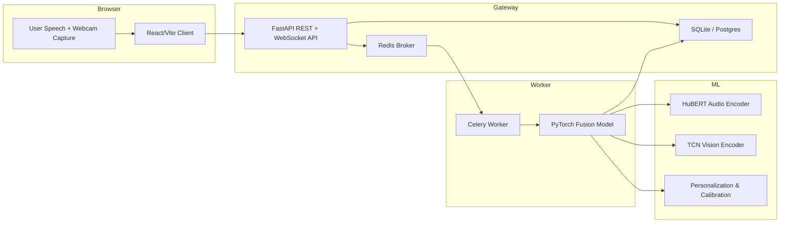

# Architecture

VerboTech is organized as a modular multimodal inference platform. It separates the concerns of browser-side capture, API gateway responsibilities, background compute, and long-term storage.

## System Architecture Overview

### Core Layers

- **Frontend** — React + Vite app that captures microphone audio and MediaPipe vision tensors in-browser.
- **API Gateway** — FastAPI service handling WebSocket ingestion, REST session management, and request routing.
- **Asynchronous Worker Layer** — Celery workers process heavy inference asynchronously to keep the gateway responsive.
- **ML Inference** — PyTorch-based fusion model combining HuBERT audio embeddings, TCN vision embeddings, and personalization logic.
- **Storage** — Persistent session data storage and optional artifact blob storage.



## Folder Structure Explanation

The current repository is intentionally segmented for maintainability and future production hardening.

- `confidence-speaker/` — frontend application with capture, dashboard, and session history.
- `confidence-backend/` — gateway application with API, WebSocket endpoint, database models, and worker launch points.
- `ml/` — AI architecture documentation and model design reference for the multimodal pipeline.

### Backend Structure

```text
confidence-backend/
  main.py              # FastAPI service definition and REST/WebSocket contract
  workers/
    celery_app.py      # Celery broker/backend configuration
    tasks.py           # Async inference and personalization workflow
  ml/models/
    fusion.py          # Multimodal model architecture
    hubert_audio.py    # Audio feature extraction wrapper
    tcn_vision.py      # Vision feature extraction wrapper
```

### Frontend Structure

```text
confidence-speaker/
  package.json
  vite.config.js
  src/
    App.jsx
    main.jsx
    screens/           # UI routes and core experiences
    utils/             # audio/video capture and analysis helpers
```

## Request Lifecycle Explanation

### 1. Session Initialization

The client begins a session by opening a WebSocket connection to the FastAPI backend at `/ws/stream/{session_id}`.

### 2. Streaming Telemetry

- Audio chunks are streamed as binary messages.
- Vision tensors are streamed as JSON frames.
- The gateway buffers payloads until the client signals completion.

### 3. Task Dispatch

When the session completes, the gateway dispatches a Celery background task (`process_multimodal_session`) with serialized audio and tensor payloads.

### 4. Asynchronous Inference

The worker performs heavy model computation outside the request thread:
- Raw audio is deserialized and standardized.
- Vision tensors are formatted and padded.
- A PyTorch fusion model returns a base confidence score.
- A calibration layer adjusts scores with acoustic and visual anchors.
- The result is returned to the gateway or persisted to storage.

### 5. Persistence and Feedback

Final session metadata is persisted through `/api/sessions` and can be retrieved via `/api/sessions/{user_id}`. User feedback is captured with `/api/feedback`.

## Async Worker Architecture Explanation

VerboTech uses Celery paired with Redis for the worker architecture.

### Key design principles

- **Separation of concerns** — the API gateway never blocks on model inference.
- **Resilience** — Redis decouples ingestion from compute and enables retries.
- **Scalability** — workers can scale horizontally for peak sessions.

### Current implementation details

- `workers/celery_app.py` configures Celery with `broker=redis://localhost:6379/0`.
- `workers/tasks.py` implements `process_multimodal_session`, which serializes audio as hex and vision tensors as JSON.
- The worker uses `SessionLocal` to update baselines and compute personalized delta scores after inference.

## Technical Decision Explanations

### Why FastAPI?

FastAPI provides asynchronous request handling, first-class WebSocket support, and industry-leading documentation generation. This enables VerboTech to maintain a responsive gateway while the background inference is offloaded.

### Why Celery + Redis?

Celery is a proven pattern for Python async workloads. Redis is lightweight, easily provisioned, and supports the low-latency queueing demands of real-time session ingestion.

### Why multimodal fusion?

Public speaking performance is inherently multimodal. Combining voice embeddings with visual engagement signals reduces single-modality bias and improves confidence score robustness.

### Why SQLite in development?

SQLite simplifies onboarding and local development. For production, PostgreSQL is the recommended target for reliability, concurrency, and analytics.

## Scaling / System Design Explanation

The architecture is built for progressive scaling.

### Horizontal scaling

- **Frontend** — deploy static assets to a CDN or edge host.
- **Gateway** — scale FastAPI behind a load balancer.
- **Workers** — scale Celery workers independently.
- **Storage** — migrate from SQLite to PostgreSQL and use S3-compatible storage for raw session artifacts.

### Performance considerations

- Use WebSockets for low-latency telemetry and fewer round trips.
- Buffer audio in memory only long enough to batch inference.
- Apply model quantization or ONNX for production inference.

### Operational design

- Use metrics and tracing for WebSocket session health.
- Add rate limiting on API endpoints.
- Keep data pipelines idempotent and retry-safe.
