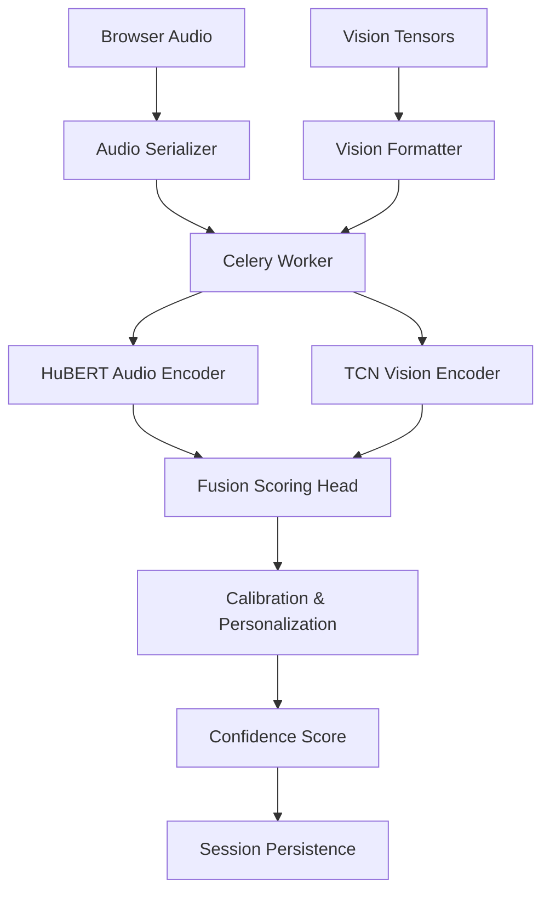

# ML Pipeline

VerboTech’s ML pipeline is designed for multimodal confidence scoring. It blends audio-based speech analysis with visual engagement signals, then calibrates the result against personalized user baselines.

## Model Inference Flow Explanation

### Step 1: Audio Capture and Preprocessing

The frontend captures raw audio at 16 kHz and streams it as binary chunks. On the worker side:

- Raw bytes are deserialized into a `Float32` array.
- A minimal quality check verifies signal length.
- The signal is standardized for the audio encoder.

### Step 2: Vision Tensor Formatting

The browser sends MediaPipe-derived facial and posture tensors in JSON form. The worker:

- Converts the JSON payload into a PyTorch tensor.
- Applies padding or zero-filled defaults if visual frames are missing.
- Produces a `torch.FloatTensor` shaped for the TCN model.

### Step 3: Audio Embeddings with HuBERT

HuBERT provides deep acoustic embeddings that capture fluency, energy, and spectral dynamics.

Typical landmarks:

- speaking cadence
- volume projection
- voiced/unvoiced transitions

### Step 4: Vision Embeddings with TCN

A lightweight Temporal Convolutional Network processes landmark sequences and outputs engagement embeddings.

Vision cues include:

- head stability
- facial expressiveness
- posture consistency

### Step 5: Fusion Model

The `ml/models/fusion.py` architecture fuses audio and vision embeddings:

- audio feature vector from HuBERT
- vision feature vector from TCN
- cross-modal concatenation
- final dense layers with dropout and normalization

The model outputs a scalar score in a 0-100 range.

### Step 6: Calibration and Personalization

A production-ready confidence score is derived by combining raw model output with heuristic anchors:

- RMS and average volume
- zero-crossing rate
- pitch variance
- visual stability

The worker also computes a personalization delta based on user-specific baselines stored in `UserBaseline`.

## Current Model Components

### `ml/models/hubert_audio.py`

Wraps HuBERT inference and audio encoding logic.

### `ml/models/tcn_vision.py`

Encodes temporal landmark sequences into a dense feature vector.

### `ml/models/fusion.py`

Implements the multimodal fusion head. The current prototype uses:

- `HubertModel.from_pretrained("facebook/hubert-base-ls960")`
- convolutional temporal processing for vision
- dropout and layer normalization for robust scoring

## Training vs Inference

In the current repository, the pipeline is optimized for inference. A production version should split training into:

- data ingestion pipeline
- supervised learning for the fusion head
- periodic evaluation against a labeled public-speaking corpus

## Quality Assurance

Key quality controls:

- verify audio sample rate and frame length
- ensure vision tensors are not empty before inference
- clamp final confidence scores to `[0, 100]`
- preserve a fallback path when visual or audio data is missing

## Future ML Enhancements

- Add transformer-based temporal attention on visual embeddings
- Export inference graphs to ONNX for low-latency deployment
- Replace heuristic calibration with learned normalization
- Add a semantic layer with ASR and transcript-level speaking quality
